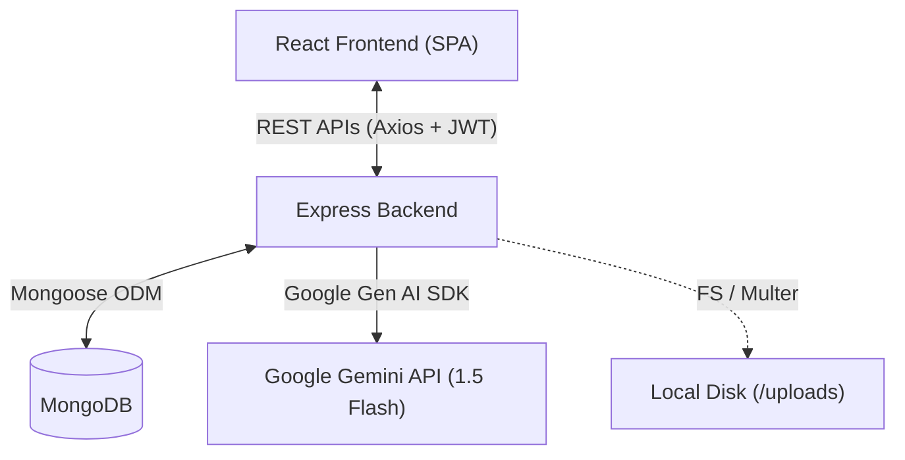
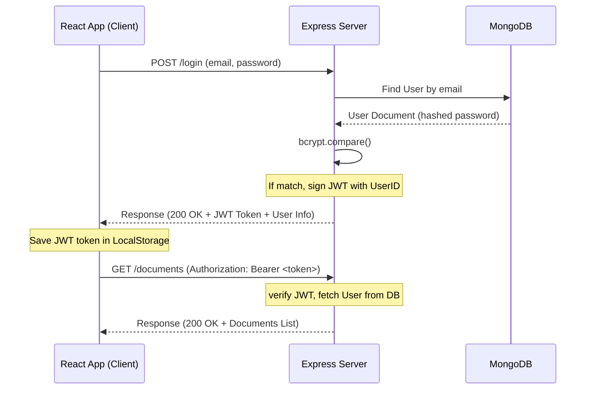

# System Architecture Design

This document details the software architecture, database design, and request flows of the **AI-Powered Knowledge Base Assistant**.

---

## High-Level System Architecture

The application is structured as a decoupled client-server architecture:

### 1. Frontend Architecture
The React single-page application is built on top of **Vite** and **TypeScript** for speedy development and type safety.
- **Context State Management**: 
  - `AuthContext`: Tracks user session token, handles login, register, and automatic cookie-less session persistence on load.
  - `ToastContext`: Exposes a global utility to display alerts (success, errors, warnings) from any nested view.
- **Service Layer**: Decoupled helper modules (`api.ts`) wrap Axios and map API endpoints. An interceptor handles inserting `Authorization: Bearer <token>` automatically.
- **Page Views**: Modular pages represent dashboard grids, file upload areas, file catalogs, text viewers, and real-time chat boxes.

### 2. Backend Architecture
The Node-Express server acts as a REST API gateway:
- **Routing Layer**: Express routes mount API paths, directing request inputs directly to designated controller modules.
- **Middleware Pipeline**: Includes CORS security, HTTP morgan logging, authentication filters, Multer file upload validators, and a global error catching block.
- **Services Layer**: Isolates external library interfaces, containing parser helpers for PDF/txt/md unzipping and text extraction, and wrappers for Gemini's AI model.

---

## Authentication Flow

Authentication is managed via JSON Web Tokens (JWT) and client-side storage:

---

## Database Design

The schema structure leverages MongoDB Document references to associate files and conversations with users:

### User Document Schema
- `_id`: ObjectId (Auto-generated)
- `name`: String (Required, trimmed)
- `email`: String (Required, unique, lowercase)
- `password`: String (Required, hashed password)
- `createdAt`: Date (Default: `Date.now`)

### Document Schema
- `_id`: ObjectId (Auto-generated)
- `title`: String (Display name, e.g., original filename)
- `fileName`: String (Unique file path saved on disk)
- `fileType`: String (enum: `pdf`, `txt`, `md`)
- `owner`: ObjectId (References `User` model, creates index)
- `uploadedAt`: Date (Default: `Date.now`)
- `metadata`: Object
  - `size`: Number (bytes count)
  - `encoding`: String
  - `pageCount`: Number
- `extractedContent`: String (Heavy text cached for QA reference)

### Conversation Schema
- `_id`: ObjectId (Auto-generated)
- `user`: ObjectId (References `User` model, creates index)
- `document`: ObjectId (References `Document` model, creates index)
- `question`: String (User query)
- `answer`: String (Gemini generated response answer)
- `timestamp`: Date (Default: `Date.now`)

---

## Request Flow: AI Question Answering

When a user selects a document and submits a question:

1. **Payload Submission**: React posts `documentId` and `question` to `/ask`.
2. **Authorization**: The auth middleware interceptor validates the JWT and injects `req.user`.
3. **Context Retrieval**: The chat controller fetches the `Document` from MongoDB using `documentId` and verifies the owner is `req.user._id`.
4. **Content Generation**: The controller extracts the document's cached `extractedContent` and invokes `askGemini(content, question)`.
5. **AI Interaction**: The Gemini service sends the formatted prompt to the Gemini API (`gemini-2.5-flash`).
6. **Persistence**: The server saves the user query and Gemini's response inside a new `Conversation` document.
7. **Response Delivery**: The server returns the final answer to the client, which appends it to the chat bubbles feed.

---

## Engineering Decisions

1. **Decoupled Architecture**: Splitting `backend` and `frontend` into separate directories allows independent configuration, package updates, and deployment pipelines (e.g. hosting client on Vercel and server on Render).
2. **Programmatic DNS Routing**: Adding `dns.setServers(['8.8.8.8'])` dynamically in `server.js` resolves the MongoDB Atlas `querySrv ECONNREFUSED` error. This bypasses local ISP router blocks without forcing developers to change their global Windows adapter properties.
3. **Optimized Text Parsing**: Storing the extracted text in the `extractedContent` field of the MongoDB `Document` schema acts as an extraction cache. This prevents expensive physical file I/O operations and page extractions on subsequent user queries.
4. **Verbatim TS Module Compilation**: Enforcing `import type` imports for TypeScript interfaces satisfies strict `verbatimModuleSyntax` rules, producing cleaner transpiled Javascript.
5. **Custom Lightweight Notification System**: Developing pure CSS/React toast contexts and modal overlays avoids heavy third-party bundles like `react-toastify`, keeping the final production bundle size compact.

---

## Future Scaling Considerations

1. **Database Search Indexes**: Add text indexes on `extractedContent`, `question`, and `answer` fields to optimize MongoDB native search filters.
2. **Object Store Storage**: Transition files from local `/uploads` storage to Amazon S3 or Google Cloud Storage to enable horizontal backend scaling (load balancers).
3. **Retrieval-Augmented Generation (RAG)**: For large files, chunk the text, compute vector embeddings using an embedding model, save them in vector databases, and perform semantic lookup. This feeds only the most relevant text slices to Gemini instead of the whole file, reducing costs and latency.
